  
  
  

  
  

- 🛰️ Building **e-commerce platforms** — Laravel backend + React frontend
- 🖥️ Developing **company websites & admin CMS panels** for Cambodian clients
- 🎓 Studying software engineering while shipping real client projects

  

**Backend:** Laravel 11/12 · PHP 8.3 · PostgreSQL
**Frontend:** Blade · React + Vite · Tailwind CSS · Alpine.js
**Deployment:** Render · Hostinger

| Project | Description | Stack |
|---|---|---|
| 🛒 [Tronmatix Computer](https://tronmatix-frontend.onrender.com/) | Full-stack Cambodian e-commerce platform — admin dashboard, delivery zones, KHQR/PayWay |   |
| 🏢 Company Websites | Multiple client sites (manufacturing, agriculture, education) |   |
| 🎵 Desktop Music Player | Cross-platform music player app |  |
| 🧑‍💻 [Personal Portfolio](https://portfolio-vichhika.onrender.com/) | My own sci-fi styled dev portfolio |   |

  
  

  

  

  
  

<code>&gt; fun_fact: Laravel by day, React by night_</code>

